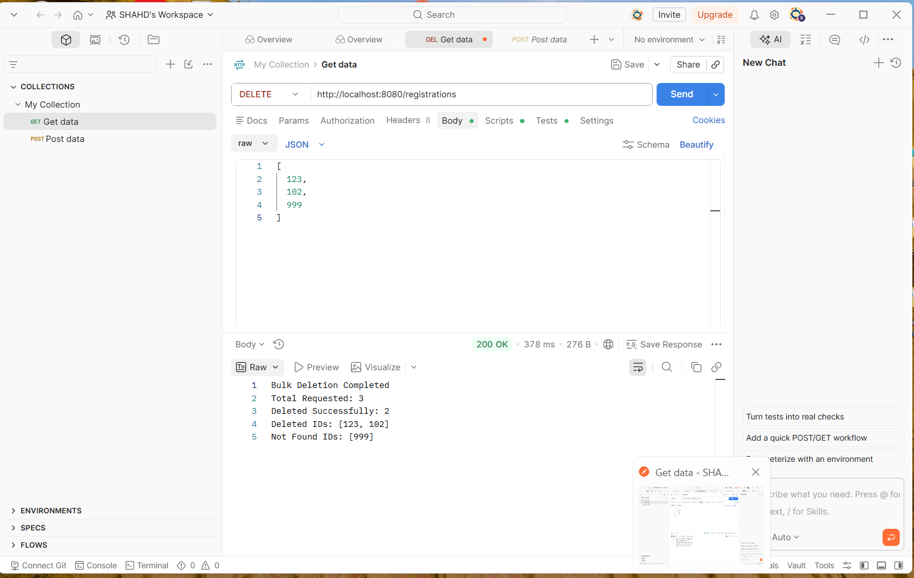

# Spring Boot DELETE Operations

This repository contains practical exercises for learning DELETE operations in Java and Spring Boot.

## Included Tasks

### Task 34
Using Java Basics for DELETE Logic – Remove a Task from a To-Do List

### Task 35
Applying Java OOP for DELETE Operations – Remove a Member from a Library System

### Task 36
Building a Java Spring Boot DELETE Endpoint – Remove a Product from Inventory

### Task 37
Bulk Event Registration Removal using Spring Boot DELETE Endpoint

## Technologies
- Java
- OOP
- Spring Boot
- REST API
- Postman

## Testing
Task 37 was tested using Postman.
## API Testing

